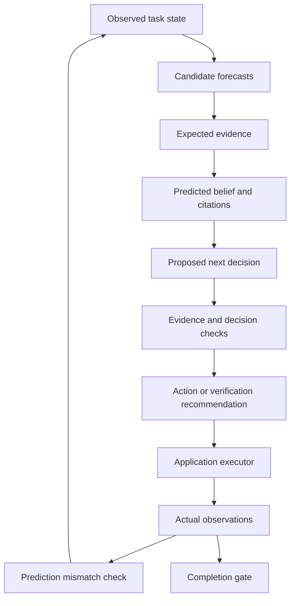

# The Foresight Agent

**Predict evidence. Anticipate beliefs. Check the next decision.**

[](https://github.com/metacognisum/The-Foresight-Agent/actions/workflows/tests.yml)
[](pyproject.toml)
[](LICENSE)

Foresight is an experimental agent-control kernel that checks whether an action's
predicted evidence would justify the agent's next belief and decision. It explores
how to detect unsupported conclusions before they propagate through a task.

> **Research preview · 0.1.0a1.** The repository contains a working Python kernel,
> offline demo, and tests. Forecasts are currently scripted. A live autonomous agent
> and empirical evidence of improvement are future work.

## Why Foresight?

An action can execute successfully while leading to the wrong conclusion. Reading
an outdated policy may work perfectly as a tool call, yet fail to justify an approval.

Foresight makes three things explicit before an action:

1. **Expected evidence:** what the action is expected to reveal.
2. **Predicted belief:** what the agent is expected to conclude, with evidence references.
3. **Next decision:** what that conclusion would lead it to do.

The controller checks those relationships, ranks candidates, and recommends additional
verification where support is missing. After execution, actual evidence determines
whether the prediction held and whether completion is allowed.

“Belief” means an explicit record of claims. Foresight does not read a model's hidden
thoughts or activations.

## Quickstart

Requires **Python 3.10+** and Git. The demo needs no API key and has no third-party
runtime dependencies.

```bash
git clone https://github.com/metacognisum/The-Foresight-Agent.git
cd The-Foresight-Agent
python3 -m foresight.demo
```

For an installed CLI, create an environment first:

```bash
python3 -m venv .venv
source .venv/bin/activate
python -m pip install .
foresight
```

On Windows, use `py` instead of `python3` and activate the environment with
`.venv\Scripts\Activate.ps1` in PowerShell. Installation may download build
requirements; running the demo directly from the checkout does not need a download.
The CLI currently runs the demo; it does not accept arbitrary tasks.

## What the demo shows

Two hand-authored forecasts compete:

| Candidate | Predicted belief | Controller finding |
| --- | --- | --- |
| Read an old policy | The request is eligible | The source is outdated; approval lacks support |
| Check the current policy | The request is eligible | The predicted evidence could justify approval |

Foresight selects the current-policy check. The supplied observation then says the
request is **not eligible**, contradicting its forecast. The result includes:

```text
selected.action: check_current_policy
transition.intervention: revise_belief
completion_allowed: false
```

The command prints the full JSON trace. No real approval is performed. This example
shows the control mechanism; it does not measure a model's ability to predict.

## Architecture



The application supplies forecasts and executes recommendations. The kernel provides
checks, ranking, discrepancy reporting, and completion gating. Predictions alone
never add facts to the observed state.

## Python API

```python
from foresight import (
    Belief, Controller, Evidence, Forecast, Requirement, State, observe,
)

controller = Controller((Requirement("eligible", "yes"),))
state = State()

expected = Evidence(
    id="policy-result", claim="eligible", value="yes",
    source="current-policy", authoritative=True, current=True,
)
forecast = Forecast(
    action="check_policy",
    evidence=(expected,),
    beliefs=(Belief("eligible", "yes", ("policy-result",)),),
    next_decision="complete",
    success_probability=0.8,
)

assessment = controller.choose(state, (forecast,))
assert assessment.intervention == "execute_then_check"
assert controller.complete(state) is False  # A forecast is not an observation.

# Illustrative observation; a real application must obtain this from its executor.
actual = Evidence(
    id="observed-result", claim="eligible", value="no",
    source="current-policy", authoritative=True, current=True,
)
transition = observe(state, forecast, (actual,), action_succeeded=True)
assert transition.intervention == "revise_belief"
assert controller.complete(transition.state) is False
```

`success_probability` refers to **tool execution success**. Its Brier score does
not measure belief truth or final task success. Candidate scores are documented
heuristics, not learned weights.

| Interface | Responsibility |
| --- | --- |
| `Evidence` / `State` | Preserve source-linked observations |
| `Belief` / `Forecast` | Describe anticipated claims and action consequences |
| `Requirement` | Define application-owned evidence conditions |
| `Controller.assess()` | Identify unsupported beliefs and decision gaps |
| `Controller.choose()` | Rank candidate forecasts and return a recommendation |
| `observe()` | Record observations and flag prediction mismatches |
| `Controller.complete()` | Check actual evidence against completion requirements |

## Scope and limitations

**Available:** structured forecasts, source checks, conflict handling, candidate
ranking, mismatch detection, completion checks, a demo, and tests.

**Planned:** live model adapters, tool execution, intervention dispatch, persistent
traces, calibrated predictors, and controlled evaluations across task types.

- Evidence matching uses exact structured predicates, not natural-language entailment.
- Source authority and freshness must come from trusted application logic. The kernel
  cannot authenticate a source or prevent a caller from fabricating evidence.
- A supported belief can contradict the desired outcome. That belief remains valid,
  while the completion requirement remains unsatisfied.
- Conflicting qualifying observations block completion. Records cannot be overwritten;
  source retraction and supersession are not yet supported.
- Intervention recommendations must be enforced by the application executor. This
  prototype does not provide a sandbox, permission system, or production runtime.

## Research foundations

The design draws engineering inspiration from forward models, reality monitoring,
metacognition, and prospective neural sequences. These connections do not establish
biological fidelity or research novelty.

Related AI work includes [RAP](https://arxiv.org/abs/2305.14992),
[Reflexion](https://arxiv.org/abs/2303.11366), and
[WorldEvolver](https://arxiv.org/abs/2606.30639). Foresight makes no claim to be the
first predictive or metacognitive agent.

- [Neuroscience foundations: evidence, analogies, and limitations](docs/neuroscience.md)
- [Research plan: architecture, prior work, baselines, and falsification criteria](docs/research-plan.md)

The key experiment is whether forecasting beliefs improves decisions beyond using
the same evidence checks without forecasting, at a comparable total budget.
**No benchmark advantage has been established.**

## Development

```bash
python3 -m unittest discover -v
python3 -m foresight.demo
git diff --check
```

CI is configured for Python 3.10, 3.12, and 3.14. It runs the tests and smoke-tests
the installed CLI outside the source tree. See the workflow badge for remote results.

```text
foresight/             Control kernel and offline demo
tests/                 Evidence and decision regression tests
docs/                  Scientific rationale and evaluation protocol
.github/workflows/     CI configuration
```

Read [CONTRIBUTING.md](CONTRIBUTING.md) for contribution guidelines and
[CHANGELOG.md](CHANGELOG.md) for release notes. The distribution name is
`metacognisum-foresight`; the import and CLI name is `foresight`. The package has
not been published to PyPI.

## License

[Apache License 2.0](LICENSE).
