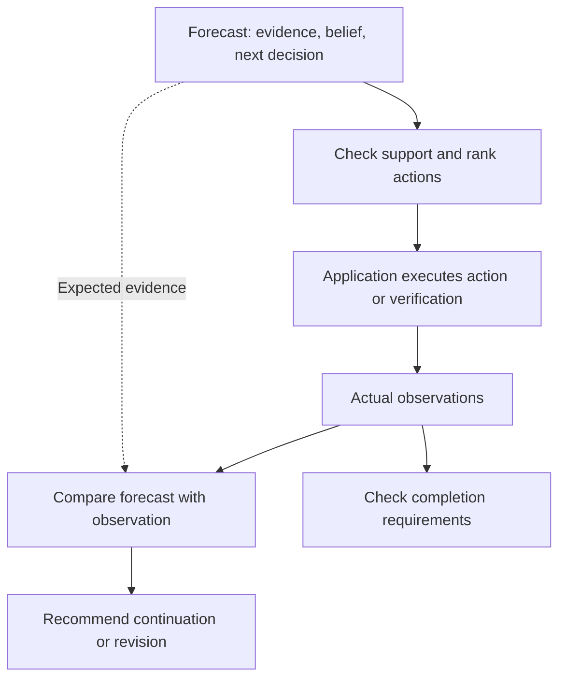

# The Foresight Agent

**What will the agent believe after its next action—and will the evidence justify it?**

[](https://github.com/metacognisum/The-Foresight-Agent/actions/workflows/tests.yml)
[](pyproject.toml)
[](LICENSE)

Foresight explores this question through explicit predictions of evidence, beliefs,
and decisions. Its Python control kernel checks whether an anticipated conclusion
is supported before recommending an action, then compares the forecast with what
actually happened.

**Research preview · 0.1.0a1 · Offline demo · Scripted forecasts**

[Run the demo](#run-the-demo) · [How it works](#how-it-works) ·
[Python guide](docs/usage.md) · [Research](#research-foundations) ·
[Contribute](CONTRIBUTING.md)

## A successful action can still lead to a wrong conclusion

An agent reads a policy and concludes that a request is eligible. The file was read
successfully—but the policy is outdated. The tool worked; the approval lacks support.

Foresight's demo compares two possible actions before either is executed:

| Proposed action | Anticipated conclusion | Evidence check |
| --- | --- | --- |
| Read the old policy | “The request is eligible.” | Outdated evidence cannot justify approval |
| Check the current policy | “The request is eligible.” | The forecast includes current, authoritative evidence |

The controller selects the current-policy check. Its supplied observation then says
the request is **not eligible**. Foresight detects the mismatch, recommends revising
the belief, and withholds completion.

**The forecast guides the choice. The observation determines what is supported.**

## Run the demo

Requires **Python 3.10+** and Git. Once cloned, the demo runs offline with no API
key or third-party runtime dependencies.

```bash
git clone https://github.com/metacognisum/The-Foresight-Agent.git
cd The-Foresight-Agent
python3 -m foresight.demo
```

The command prints a JSON trace. The key fields are:

```text
selected.action: check_current_policy
transition.intervention: revise_belief
completion_allowed: false
```

The scenario uses hand-authored forecasts and observations. It demonstrates the
mechanism without executing a real approval.

For the installed CLI, Windows setup, and a complete Python example, see the
[usage guide](docs/usage.md).

## How it works

Each candidate forecast describes **expected evidence**, a **predicted belief with
source references**, and the **decision that belief would lead to**. The controller
checks these relationships and ranks candidates. The application executes the
recommendation and supplies observations for comparison.



Predictions never automatically become observed facts. A supported belief can also
contradict the goal: “the request is ineligible” may be correct even though approval
is blocked. Here, *belief* means an explicit claim record, not a model's hidden thoughts.

## Current capabilities and roadmap

| Available in this preview | Next milestones |
| --- | --- |
| Structured evidence, beliefs, and forecasts | Live model adapter for generating forecasts |
| Evidence checks and candidate ranking | Shadow-mode evaluation of predicted beliefs |
| Prediction mismatch reports | Tool execution and intervention dispatch |
| Completion checks over observed evidence | Persistent traces and bounded runs |
| Offline demo and regression tests | Controlled evaluations across task types |

This preview is a control kernel. Applications provide forecasts, trusted source
attributes, and execution. Matching uses exact structured facts; it does not establish
natural-language truth or authenticate sources. Conflicting qualifying evidence blocks
completion, and source retraction is not yet supported. See the
[integration boundaries](docs/usage.md#integration-boundaries) before extending it.

## Research foundations

Forward models motivate anticipating consequences. Reality monitoring motivates
separating imagined information from observation. Metacognitive monitoring motivates
checking whether a conclusion is justified. These are engineering inspirations;
they do not establish biological fidelity or novelty.

The research question is concrete: **does predicting future beliefs improve decisions
beyond using the same evidence checks without forecasting, at a comparable budget?**
No benchmark advantage has been established.

Read the [neuroscience rationale](docs/neuroscience.md) for evidence and limitations,
and the [evaluation plan](docs/research-plan.md) for baselines and falsification criteria.
Related work includes [RAP](https://arxiv.org/abs/2305.14992),
[Reflexion](https://arxiv.org/abs/2303.11366), and
[WorldEvolver](https://arxiv.org/abs/2606.30639).

## Contributing

Counterexamples, evidence-handling improvements, and reproducible evaluations are
especially welcome. Start with [CONTRIBUTING.md](CONTRIBUTING.md).

```bash
python3 -m unittest discover -v
```

CI is configured for Python 3.10, 3.12, and 3.14 and checks the installed CLI outside
the source tree. The test badge above links to current workflow results.

[Source](foresight/) · [Tests](tests/) · [Release notes](CHANGELOG.md)

## License

[Apache License 2.0](LICENSE).
